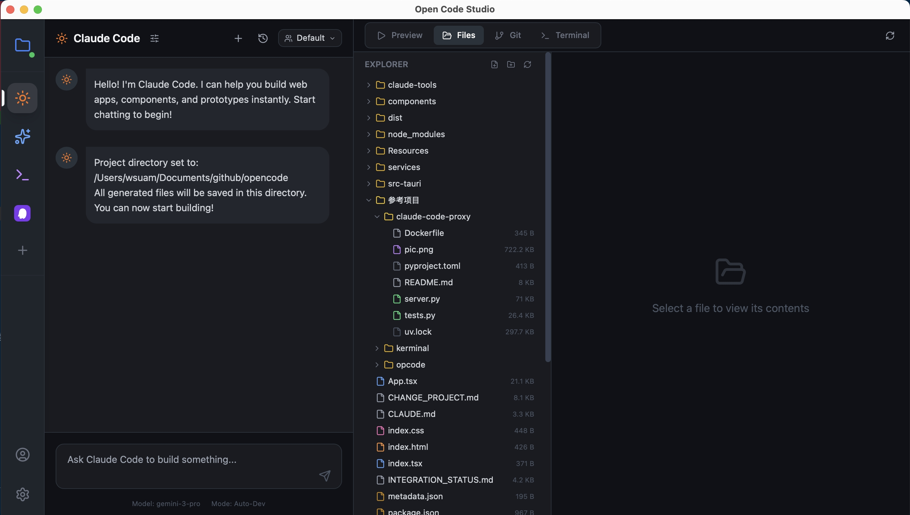
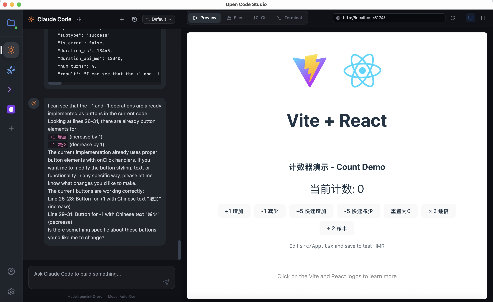
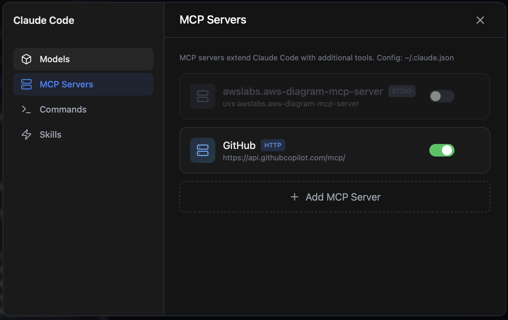
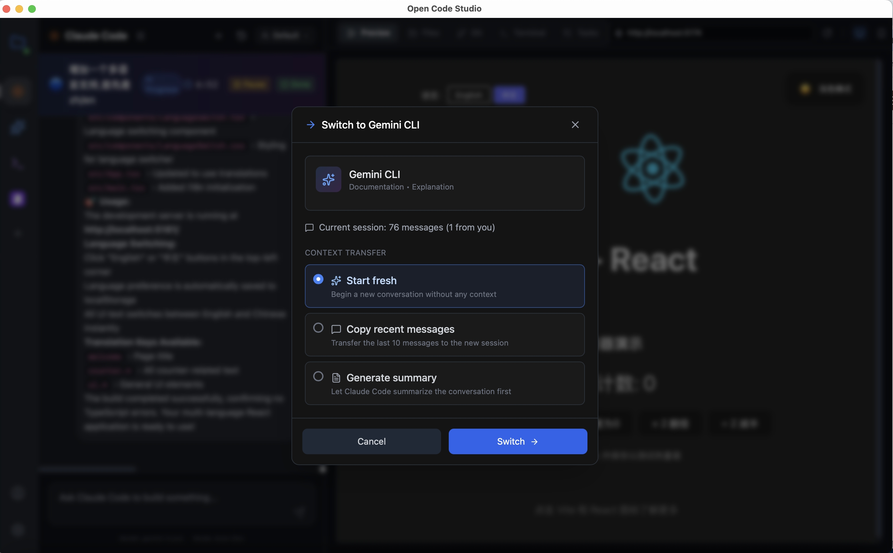
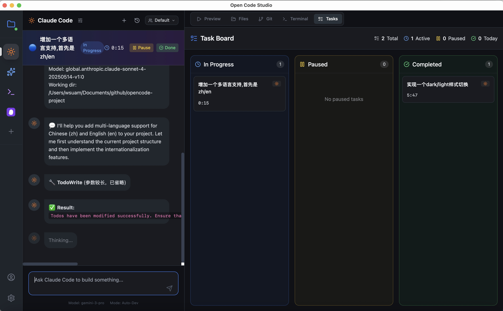

<div align="center">

# VoltCode

**AI-powered IDE for generating and previewing web applications**

A modern desktop application built with Tauri + React + TypeScript, featuring chat-based code generation with multiple AI backends.



</div>

## ✨ Features

- 🤖 **Multiple AI Backends** - Support for Claude Code, Gemini, Codex, and Kiro
- 💬 **Chat-based Code Generation** - Natural language to code conversion
- 🖥️ **Live Preview** - Real-time preview of generated web applications
- 📁 **File Explorer** - Browse and edit project files
- 🔧 **Integrated Terminal** - Full PTY terminal with xterm.js
- 🎨 **Dark Theme IDE** - Modern dark-themed interface
- 📱 **Responsive Preview** - Toggle between mobile and desktop viewports
- 🔌 **MCP Server Support** - Configure Model Context Protocol servers (stdio & HTTP)
- 📦 **Git Integration** - Built-in Git support for version control
- 🔄 **Switch AI Agent** - Easily switch between different AI agents
- 📋 **Task Panel** - Track and manage coding tasks

## 📸 Screenshots

### Main Interface


### Vibe Coding with Live Preview


### MCP Server Configuration


### MCP Server Test


### Git Integration


### Switch AI Agent


### Task Panel


## 🏗️ Architecture

```
voltcode/
├── App.tsx                 # Main application orchestrator
├── components/
│   ├── ChatPanel.tsx       # Chat interface with AI
│   ├── WorkspacePanel.tsx  # Preview/Code/Terminal tabs
│   ├── Sidebar.tsx         # Tool selector
│   ├── XTerminal.tsx       # Terminal component (xterm.js)
│   ├── ProjectSelector.tsx # Project folder selection
│   └── ConfigPanel.tsx     # Settings modal
├── services/
│   ├── gemini.ts           # Gemini AI integration
│   ├── cliRouter.ts        # CLI routing for AI tools
│   ├── sidecar.ts          # Sidecar process management
│   └── slashCommands.ts    # Slash command parser
├── src-tauri/
│   ├── src/lib.rs          # Rust backend (PTY, process management)
│   └── tauri.conf.json     # Tauri configuration
└── Resources/
    ├── bundled-node/       # Bundled Node.js runtime
    ├── bundled-agents/     # AI agent configurations
    └── codex-acp/          # Codex CLI integration
```

## 🚀 Getting Started

### Prerequisites

- **Node.js** >= 18.0
- **pnpm** (recommended) or npm
- **Rust** >= 1.70 (for Tauri)

### Installation

1. **Clone the repository**
   ```bash
   git clone https://github.com/stevensu1977/voltcode.git
   cd voltcode
   ```

2. **Install dependencies**
   ```bash
   pnpm install
   ```

3. **Configure API Keys**

   Copy the example environment file and add your API key:
   ```bash
   cp .env.local.example .env.local
   ```

   Edit `.env.local` and set your Gemini API key:
   ```
   GEMINI_API_KEY=your_api_key_here
   ```

4. **Run in development mode**
   ```bash
   pnpm run tauri:dev
   ```

5. **Build for production**
   ```bash
   pnpm run tauri:build
   ```

### Configure Claude Code with Amazon Bedrock

To use Claude Code with Amazon Bedrock, set the following environment variables:

```bash
# Set Claude to use Amazon Bedrock
export CLAUDE_CODE_USE_BEDROCK=1

# Configure AWS region
export AWS_REGION=us-west-2

# Optional: Specify Bedrock model (defaults to Claude Sonnet)
export ANTHROPIC_MODEL=us.anthropic.claude-sonnet-4-20250514-v1:0

# Ensure AWS credentials are configured
# Option 1: Use AWS CLI profile
export AWS_PROFILE=your-profile

# Option 2: Use access keys directly
export AWS_ACCESS_KEY_ID=your-access-key
export AWS_SECRET_ACCESS_KEY=your-secret-key
```

> **Note**: Make sure you have enabled Claude models in your AWS Bedrock console and have the necessary IAM permissions.

## 🛠️ Tech Stack

| Layer | Technology |
|-------|------------|
| **Desktop Framework** | [Tauri 2.0](https://tauri.app/) |
| **Frontend** | React 19 + TypeScript |
| **Styling** | Tailwind CSS |
| **Build Tool** | Vite |
| **Terminal** | xterm.js + portable-pty |
| **AI Integration** | Google Gemini, Claude Code |

## 📦 Available Scripts

| Command | Description |
|---------|-------------|
| `pnpm dev` | Start Vite dev server only |
| `pnpm build` | Build frontend for production |
| `pnpm tauri:dev` | Run Tauri app in development |
| `pnpm tauri:build` | Build Tauri app for distribution |

## 🔌 AI Tools

VoltCode supports multiple AI backends:

- **Claude Code** - Anthropic's Claude with coding capabilities
- **Gemini** - Google's Gemini Pro with thinking budget
- **Codex** - OpenAI Codex integration
- **Kiro** - Custom AI agent

Switch between tools using the sidebar icons.

## 📄 License

MIT License - see [LICENSE](LICENSE) for details.

## 🤝 Contributing

Contributions are welcome! Please feel free to submit a Pull Request.
